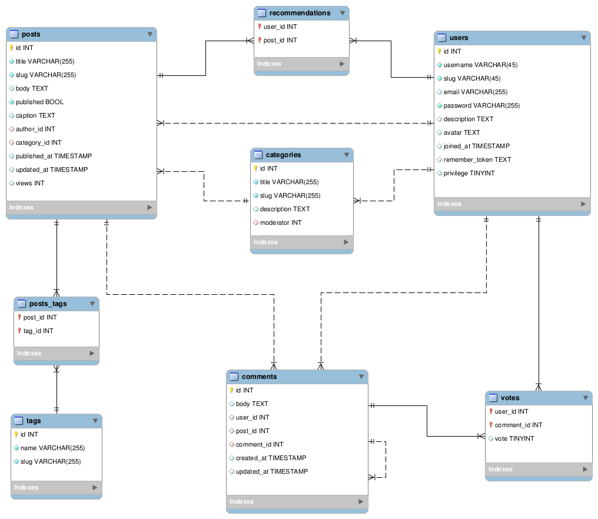
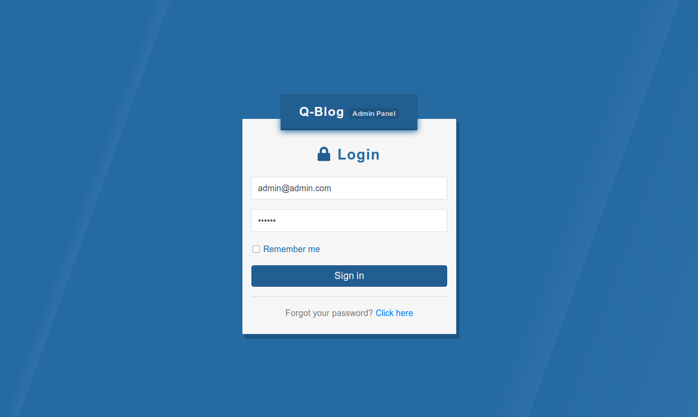
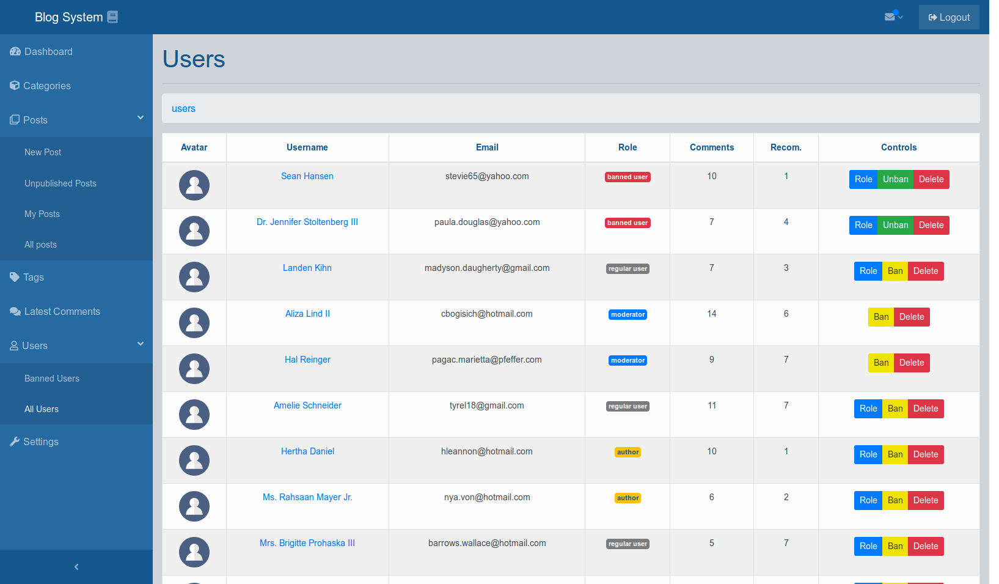
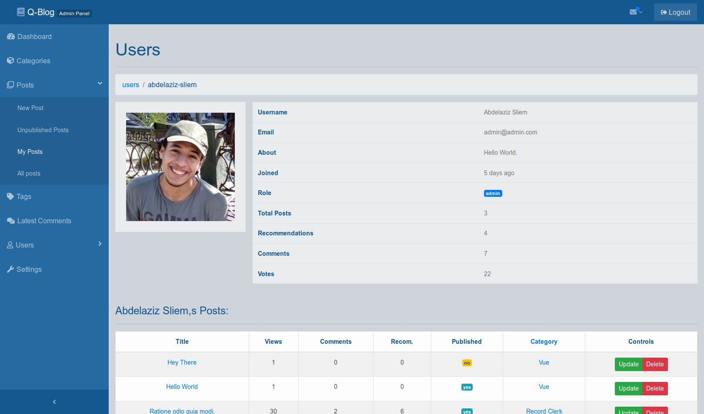
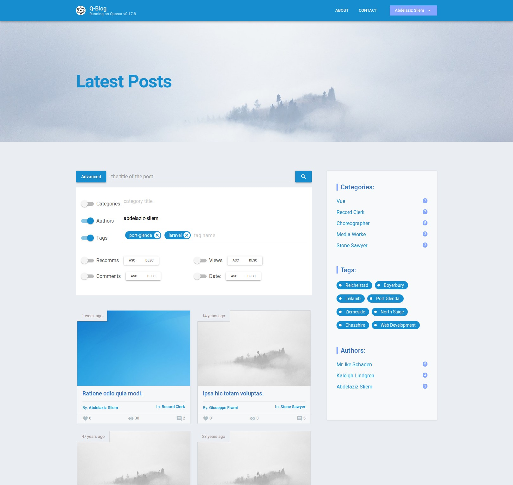
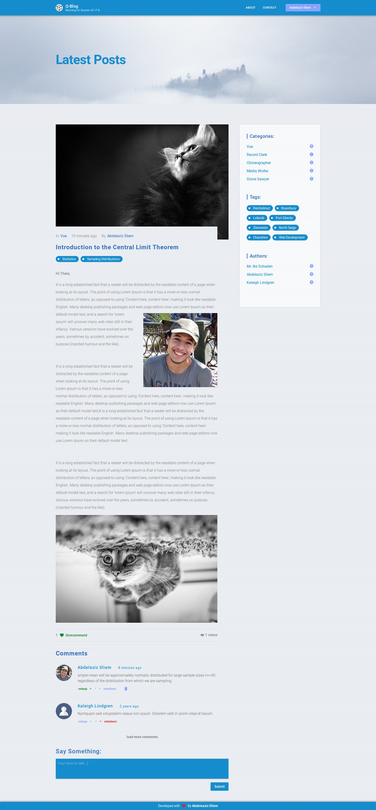

# Q-Blog

\- A very simple Blog with Admin Panel built using [**Laravel5.6**,  **VueJs2.5**,  **Quasar0.17**].

\- This is kind of implementation on different concepts in web development.

\- Feel free to copy, read, fork, or whatever you want.

------

## Overview:

\- The repository consists of 3 main directories with 3 applications.

#### :arrow_forward: backend directory:

\- Contains the REST API, where you can find implementation for different concepts like:

- Authentication using `jwt-auth`.
- Authorization using policies and gates.
- Repository Pattern to split the database logic from the business logic.
- Uploading  and manipulate images using `intervention/image`.
- Upload post with many images as the body of the post.
- Unit testing [soon - contributions are welcomed].

> If you are using **postman**, you can use the collection `./dev/requirements/Q-Blog.postman_collection.json` 

#### :arrow_forward: blog and admin-panel directories:

\- Contains the **public site** and the **admin panel** apps.

\- Here you can find implementation for different concepts like:

- State management pattern using `Vuex`.
- Authentication using `vue-auth` [handling refresh token not completed - contributions are welcomed].
- Talk to the API using `axios`.
- Using Vue single-file-components.
- WYSIWYG Editor using `jodit`.
- Implementing laravel gates and policies in SPA.

\- The public site was built using quasar.

------

\- You can find the Installation steps [here](https://github.com/abdelaziz321/Q-Blog/wiki/Installation).

\- The default user credentials are:

```javascript
let userCredentials = {
  email: 'admin@admin.com',
  password: 111111
}
```

**Happy Coding :slightly_smiling_face:**.

---

## Database Diagram:



------

## Screenshots:











------

## Ask a Question?

If you have any question, contact me via my email:

> abdelazizmahmoud321@gmail.com
